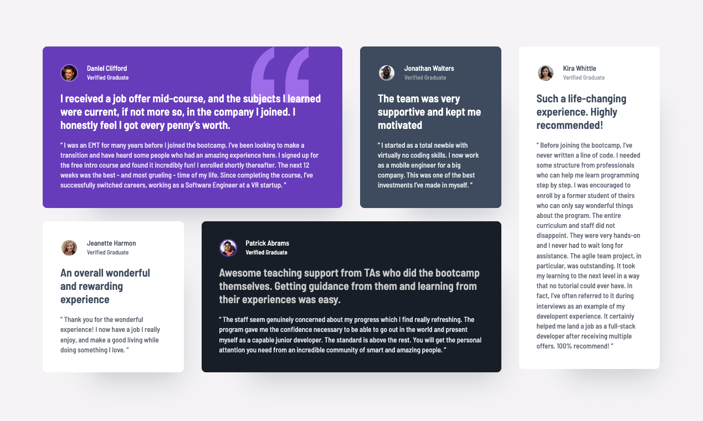

# Frontend Mentor - Testimonials grid section

[Frontend Mentor](https://www.frontendmentor.io) challenges help you improve your coding skills by building realistic projects.

## The challenge

Your challenge is to build out this testimonials grid section and get it looking as close to the design as possible.

You can use any tools you like to help you complete the challenge. So if you've got something you'd like to practice, feel free to give it a go.

Your users should be able to:

- View the optimal layout for the site depending on their device's screen size

Want some support on the challenge? [Join our community](https://www.frontendmentor.io/community) and ask questions in the **#help** channel.

## Table of contents

- [Overview](#overview)
  - [Screenshot](#screenshot)
  - [Links](#links)
- [My process](#my-process)
  - [Built with](#built-with)
- [Author](#author)

### Screenshot

### Links

- Solution URL: [Add solution URL here](https://github.com/TomDoneix/testimonials-grid-section)
- Live Site URL: [live site URL here](https://testimonials-grid-section-three-rust.vercel.app/)

## My process

### Built with

- Semantic HTML5 markup
- CSS custom properties
- Grid
- Tailwind
- Vite

## Author

- Frontend Mentor - [@tomdoneix](https://www.frontendmentor.io/profile/TomDoneix)
